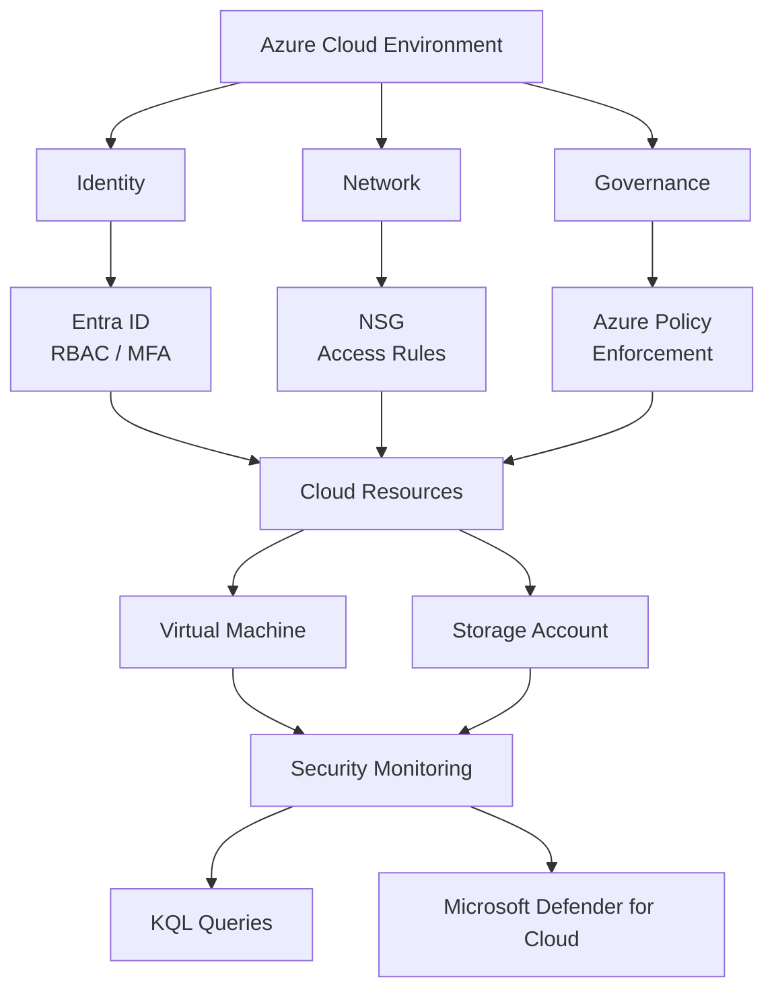
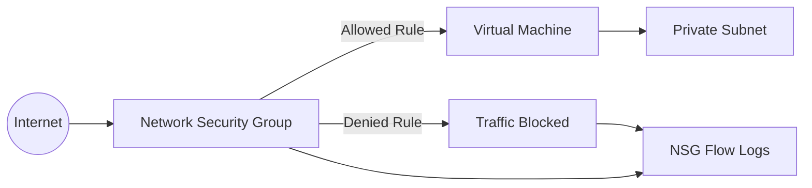
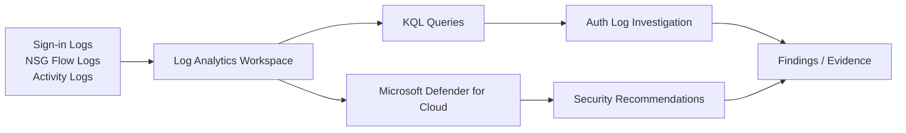

# Cloud Security Monitoring Lab


> A hands-on Azure lab demonstrating cloud security controls,
> governance, security monitoring, and investigation.

<br>

## Executive Summary

This project demonstrates how I applied practical **Cloud Security +
Security Operations** concepts in an Azure environment.

The lab focused on: - Identity and access management - Network
security - Storage security - Governance and policy enforcement -
Security monitoring - Authentication log investigation with KQL -
Microsoft Defender for Cloud recommendations

The goal was not only to configure controls, but to **validate their
security effect with hands-on tests and evidence**.


<br>

> **Note:** Azure subscription availability limited some later
> end-to-end monitoring work. Incomplete components are identified as
> future improvements rather than presented as completed.

<br>

------------------------------------------------------------------------
<br>

## Architecture


<br>

------------------------------------------------------------------------
<br>

## Security Controls

### 1. Identity & Access Management

**Objective:** Apply least privilege and stronger authentication.

**Implemented:** - Microsoft Entra ID - Azure RBAC - Least-privilege
permissions - MFA

<br>
<br>
A test user was given restricted storage access and read-only VM access,
and MFA was validated.


<div align="center">
    RBAC role assignment / restricted permissions.
</div>

<br>
<br>


<div align="center"> 
    MFA validation
</div>

<br>

------------------------------------------------------------------------

<br>

### 2. Network Security

<br>

**Objective:** Reduce unnecessary network exposure to the VM.

An Azure Network Security Group was configured to restrict inbound
access to a trusted source. An unauthorized connection attempt was
blocked.

<br>
<br>



<br>
<br>


<div align="center"> 
    Relevant NSG inbound rule.
</div>

<br>
<br>


<div align="center">
    Unauthorized connection was blocked.
</div>

<br>

------------------------------------------------------------------------

<br>

### 3. Storage Security & Data Protection

**Objective:** Reduce the risk of unintended public access to cloud
data.

<br>

**Implemented:** - Public access restrictions - Encryption at rest -Time-bound SAS access - Granular permissions


<div align="center"> 
    Public access restrictions and encryption settings.
</div>

> **Warning:** Never publish SAS tokens, access keys, passwords,
> or other secrets. Redact them from screenshots before uploading to
> GitHub (as the SAS token in the image above is no longer active).

<br>

------------------------------------------------------------------------


<br>

### 4. Governance & Policy Enforcement

<br>
<br>

**Objective:** Prevent defined non-compliant configurations from being
deployed.

Azure Policy was used as a governance control. A controlled policy
violation was tested and the deployment was blocked.

<br>
<br>


<br>
<br>


<div align="center">
    *Blocked deployment result as a result of not adhering to organisation's policy.*
</div>

<br>

------------------------------------------------------------------------

<br>
<br>

### 5. Security Monitoring & Investigation

<br>

**Objective:** Use security telemetry to investigate authentication
activity.

<br>

The project included: - Security event monitoring - Failed
authentication analysis - KQL-based investigation - Microsoft Defender
for Cloud recommendations

<br>
<br>



<br>
<br>

### The KQL query.

<br>


<br>
<br>


<div align="center">
    *Failed-authentication events.*
</div>

<br>

------------------------------------------------------------------------

<br>

## Detection Use Case


### Failed Authentication Investigation

<br>

**Scenario:** Failed authentication events occur against a cloud
workload.

Investigation questions: - Which account was targeted? - What source
generated the events? - When did the activity occur? - How many failures
occurred? - Was there a successful login afterward? - Is the activity
consistent with normal behavior? - Could it indicate brute-force or
credential abuse?

**Telemetry:** SecurityEvent, Syslog, authentication events

**Investigation tool:** KQL

<br>

------------------------------------------------------------------------

<br>

## Security Findings & Remediation

  -----------------------------------------------------------------------
  Finding                 Security Impact         Remediation
  ----------------------- ----------------------- -----------------------
  Unnecessary public      Increased attack        Restricted access
  exposure                surface                 

  Storage exposure        Potential unauthorized  Disabled public access
                          data access             and strengthened
                                                  storage controls

  Broad permissions       Greater impact from     Applied RBAC / least
                          compromised accounts    privilege

  Unrestricted inbound    Increased attack        Applied NSG
  access                  surface                 restrictions

  Non-compliant           Security policy         Applied Azure Policy
  configuration           violation               enforcement

  Failed authentication   Potential credential    Investigated
  activity                abuse                   authentication events
                                                  with KQL
  -----------------------------------------------------------------------

<br>

------------------------------------------------------------------------


<br>

## Security Workflow


<br>


<br>

The project helped me connect cloud infrastructure security with
security operations rather than treating them as separate areas.

<br>

------------------------------------------------------------------------

<br>

## Limitations

Azure subscription availability affected the later stages of the planned
monitoring pipeline.

Therefore, this project distinguishes between: - **Controls implemented
and validated** - **Monitoring/investigation activities demonstrated** -
**Future components**

The project does not claim incomplete end-to-end components as fully
operational.


<br>

------------------------------------------------------------------------


<br>

## Future Improvements

-   Expand KQL detection rules
-   Add alert-driven incident workflows
-   Complete end-to-end Linux/security telemetry ingestion
-   Add automated response with appropriate safeguards
-   Add additional cloud attack scenarios
-   Integrate incident/ticket management
-   Expand service-principal and workload-identity monitoring
  
<br>

------------------------------------------------------------------------

<br>

## Technologies

**Cloud:** Microsoft Azure

**Identity:** Microsoft Entra ID, Azure RBAC, MFA

**Network Security:** Azure NSG, TCP/IP

**Data Protection:** Azure Storage, encryption at rest, SAS

**Governance:** Azure Policy

**Monitoring & Detection:** KQL, SecurityEvent, Syslog, Microsoft
Defender for Cloud

**Security Concepts:** Least Privilege, Defense in Depth, Threat
Detection, Security Monitoring, Incident Investigation


<br>

------------------------------------------------------------------------
<br>

## Evidence Structure

``` text
├── identity/
│   ├── rbac.png
│   └── mfa.png
│
├── network/
│   ├── nsg-rules.png
│   └── blocked-connection.png
│
├── storage/
│   └── storage-hardening.png
│
├── governance/
│   └── policy-block.png
│
└── monitoring/
    ├── kql-query.png
    ├── query-results.png
    └── defender-recommendations.png
```
<br>

------------------------------------------------------------------------
<br>

## AI-Assisted Learning

ChatGPT was used as a supporting learning and troubleshooting aid during
the project to help explain unfamiliar concepts, reason through
implementation approaches, and troubleshoot configuration issues.

Implementation decisions and security claims were validated through
hands-on configuration, testing, documentation, and project evidence.
